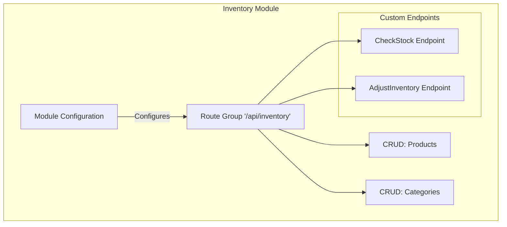

# Modular architecture

[Back to README](../README.md)

## Index

- [Design philosophy](#design-philosophy)
- [What is a module?](#what-is-a-module)
- [Differences from traditional Controllers](#differences-from-traditional-controllers)
- [Relationship with Vertical Slice Architecture](#relationship-with-vertical-slice-architecture)
- [Example: multiple CRUDs and custom endpoints](#example-multiple-cruds-and-custom-endpoints)

---

## Design philosophy

FastSharp does not organize the backend around traditional technical layers (Controllers, Services, Repositories), but around **domain modules**.

> 🧠 If you are looking for practical project structure guidance, see [How to FastSharp](how-to-fastsharp.md).

Its main perspective is:

- **Modules** define the route group and the API contract
- **Endpoints** implement behavior as independent classes
- **`AddCRUD`** is an optional shortcut for standard REST operations

Each module represents a functional capability of the system and acts as a composition and configuration unit.

The goal is:
- Reduce friction when creating APIs
- Keep high cohesion by domain
- Make project and team scalability easier

---

## What is a module?

A module represents a specific domain or feature of the system.  
A module can group **multiple CRUDs** and **custom endpoints** under a single context.

Depending on the scenario, a module can be:

- a **custom-endpoints-only** module using `Module`
- a **CRUD-enabled** module using `Module<TDbContext>`

A module is responsible for:
- Defining the route group and the module contract
- Registering endpoints (with `Include<T>()`)
- Declaring generic CRUDs when needed
- Configuring HTTP metadata (tags, descriptions, routes)
- Acting as a domain boundary

A module **should not**:
- Contain business logic
- Implement queries directly
- Access or couple to other modules

---

## Differences from traditional Controllers

A `Module` is **not** a traditional MVC controller.

Main differences:
- It does not inherit from `ControllerBase`
- It does not handle requests directly
- It does not define HTTP actions
- Its responsibility is **composing and configuring endpoints**
- Actual request behavior is implemented by `IEndpoint` classes or generated CRUD endpoints

This avoids oversized controllers and promotes a domain-based organization.

---

## Relationship with Vertical Slice Architecture

FastSharp is inspired by **Vertical Slice Architecture**, but it does not enforce one slice per endpoint.

Instead:
- It groups multiple related slices within a single domain module
- It allows CRUDs and custom endpoints to coexist
- It keeps cohesion without excessively fragmenting the code

This offers a balance between granularity and simplicity.

---

## Modules and endpoints

FastSharp separates structure from behavior:

- `Module` or `Module<TDbContext>` defines the route group, metadata, and endpoint composition
- `IEndpoint` provides the explicit implementation of a custom route
- `AddCRUD(...)` provides generated implementations for common REST operations when useful

This means FastSharp should be understood as **modules first, endpoints second, CRUD optional**.

---

## Example: multiple CRUDs and custom endpoints

```csharp
// YourProject/Modules/Inventory/InventoryModule.cs
using FastSharp.Modules.Core;
using FastSharp.Modules.Configuration;
using YourProject.Data;
using YourProject.Models;

public class InventoryModule : Module<YourDbContext>
{
    public InventoryModule()
    {
        ConfigureModule("/api/inventory", module =>
        {
            module.WithTags("Inventory")
                 .WithDescription("Inventory domain endpoints");
        });

        // CRUDs for multiple entities
        AddCRUD<Product, int>("/products");
        AddCRUD<Category, int>("/categories");

        // Custom endpoints under the same module
        Include<CheckStock>();
    }
}
```

In this example:

- the module contract is the `/api/inventory` route group
- CRUD behavior is added for `Product` and `Category`
- `CheckStock` is an explicit endpoint implementation included in the same module

Custom endpoints are mapped on the module route group. For example, if `CheckStock` maps `"/{id}/stock"`, the final route becomes `/api/inventory/{id}/stock`.

---

## Custom-endpoints-only modules

Not every module needs CRUD or EF Core.

You can also define a plain `Module` and include only explicit `IEndpoint` implementations:

```csharp
using FastSharp.Modules.Core;

public sealed class HealthModule : Module
{
    public HealthModule()
    {
        ConfigureModule("/api", group => group.WithTags("Health"));
        Include<HealthPingEndpoint>();
    }
}
```

This mode is useful for:

- health or ping endpoints
- utility APIs
- custom flows that do not need EF Core-backed CRUD

## Visual representation


