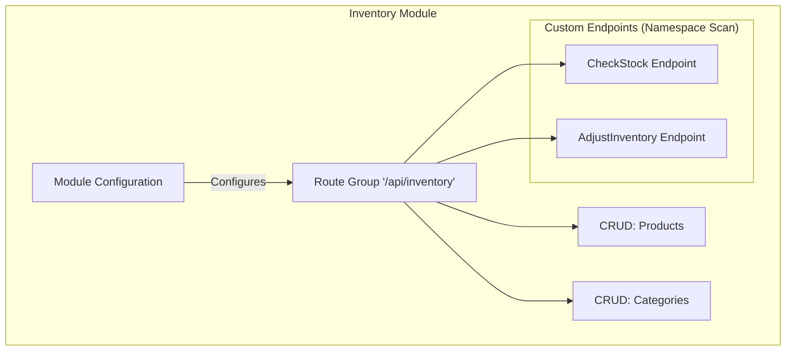

# Modular architecture

[Back to README](../README.md)

## Index

- [Design philosophy](#design-philosophy)
- [What is a module?](#what-is-a-module)
- [Differences from traditional Controllers](#differences-from-traditional-controllers)
- [Relationship with Vertical Slice Architecture](#relationship-with-vertical-slice-architecture)
- [Example: multiple CRUDs and custom endpoints](#example-multiple-cruds-and-custom-endpoints)

---

## Design philosophy

FastSharp does not organize the backend around traditional technical layers (Controllers, Services, Repositories), but around **domain modules**.  
Each module represents a functional capability of the system and acts as a composition and configuration unit.

The goal is:
- Reduce friction when creating APIs
- Keep high cohesion by domain
- Make project and team scalability easier

---

## What is a module?

A module represents a specific domain or feature of the system.  
A module can group **multiple CRUDs** and **custom endpoints** under a single context.

A module is responsible for:
- Registering endpoints
- Declaring generic CRUDs
- Configuring HTTP metadata (tags, descriptions, routes)
- Acting as a domain boundary

A module **should not**:
- Contain complex business logic
- Implement queries directly
- Access or couple to other modules

---

## Differences from traditional Controllers

A `Module` is **not** a traditional MVC controller.

Main differences:
- It does not inherit from `ControllerBase`
- It does not handle requests directly
- It does not define HTTP actions
- Its responsibility is **composing and configuring endpoints**

This avoids oversized controllers and promotes a domain-based organization.

---

## Relationship with Vertical Slice Architecture

FastSharp is inspired by **Vertical Slice Architecture**, but it does not enforce one slice per endpoint.

Instead:
- It groups multiple related slices within a single domain module
- It allows CRUDs and custom endpoints to coexist
- It keeps cohesion without excessively fragmenting the code

This offers a balance between granularity and simplicity.

---

## Example: multiple CRUDs and custom endpoints

```csharp
// YourProject/Modules/Inventory/InventoryModule.cs
using FastSharp.Modules;
using FastSharp.Modules.Configuration;
using YourProject.Data;
using YourProject.Models;

public class InventoryModule : Module<YourDbContext>
{
    public InventoryModule()
    {
        ConfigureModule("/api/inventory", module =>
        {
            module.WithTags("Inventory")
                 .WithDescription("Inventory domain endpoints");
        });

        // CRUDs for multiple entities
        AddCRUD<Product, int>("/products");
        AddCRUD<Category, int>("/categories");

        // Custom endpoints under the same module
        IncludeNamespace<CheckStock>();
    }
}
```

## Visual representation

