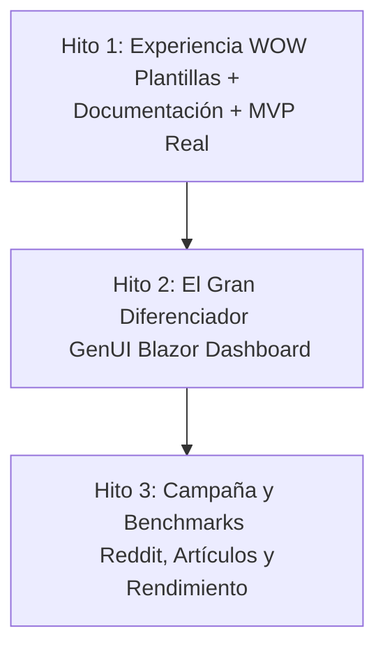

# 🗺️ FastSharp: Estrategia de Crecimiento y Evangelización

Este documento establece la hoja de ruta estratégica para posicionar a **FastSharp** como la biblioteca preferida para el desarrollo rápido y modular de APIs en el ecosistema de .NET, sirviendo a su vez como plataforma para que los colaboradores clave obtengan la distinción de **Microsoft MVP (Most Valuable Professional)**.

---

## 🎯 1. Visión y Propuesta de Valor

En la actualidad, el desarrollo de MVPs y APIs rápidas en .NET sufre de fricción debido al exceso de código repetitivo (*boilerplate*) y arquitecturas sobrediseñadas en fases tempranas. FastSharp resuelve esto al fusionar la agilidad típica del ecosistema Node.js con el rendimiento y la seguridad del ecosistema .NET 10.

* **Modularidad por Dominio**: Fronteras claras de vertical slices en lugar de capas técnicas.
* **CRUD Opcional de Alta Velocidad**: Endpoints respaldados por EF Core listos en una sola línea de código.
* **Cero Reflexión en Ejecución**: Uso intensivo de *Source Generators* para garantizar compatibilidad con compilación nativa (AOT) y tiempos de arranque instantáneos.

---

## 🚀 2. Hitos Críticos de Adopción

Para lograr una adopción masiva, dividiremos el crecimiento en tres fases estratégicas:

### 📍 Hito 1: La Experiencia Inicial "WOW" (Zero to Code)
*Objetivo: Minimizar el "Tiempo para el Primer Resultado" del desarrollador.*

* **Plantillas de CLI (`dotnet new`)**:
  * Crear la plantilla de proyecto `fastsharp-api` con el comando `dotnet new fastsharp-api`.
  * Soportar la selección dinámica de bases de datos mediante parámetros (ej: `--db SQLServer`, `--db MySQL`, `--db SQLite`).
  * Crear la plantilla de ítem `fastsharp-module` para inyectar un nuevo dominio directamente en un proyecto existente.
* **Aplicación de Referencia Real (e-commerce MVP)**:
  * Desarrollar un caso de uso completo de extremo a extremo que combine FastSharp en el backend con Blazor en el frontend, demostrando el reuso de DTOs y validaciones en C#.
* **Documentación Interactiva**:
  * Crear un portal web moderno (usando VitePress o Starlight) con guías rápidas, ejemplos de código claros y explicaciones de arquitectura.

### 📍 Hito 2: El Gran Diferenciador (GenUI Blazor)
*Objetivo: Brindar una funcionalidad única en el mercado que obligue a los desarrolladores a elegir FastSharp.*

* **Metadata Extraction**:
  * Implementar un extractor de metadatos que lea la estructura de los módulos y los DTOs configurados.
* **Auto-Dashboard (/admin)**:
  * Generar de forma dinámica y automática pantallas CRUD en Blazor para cualquier módulo registrado.
  * Diseñar tablas inteligentes con ordenamiento y paginación basados en los metadatos expuestos.
  * Renderizar formularios con validación del lado del cliente sincronizados con las reglas de FluentValidation del backend.

### 📍 Hito 3: La Campaña de Difusión y Benchmarks
*Objetivo: Respaldar las afirmaciones de agilidad con datos de rendimiento y evangelizar en la comunidad.*

* **Pruebas de Rendimiento (Benchmarks)**:
  * Utilizar BenchmarkDotNet para medir el consumo de memoria, cold-start y peticiones por segundo frente a controladores tradicionales y FastEndpoints.
* **Campaña de Lanzamiento**:
  * Publicación oficial en `/r/dotnet` de Reddit.
  * Envío del proyecto a boletines técnicos relevantes de .NET.
  * Publicaciones técnicas de alto valor (Dev.to, Medium, LinkedIn).

---

## 🎖️ 3. Camino al Microsoft MVP

El reconocimiento de Microsoft MVP premia el liderazgo y las contribuciones valiosas a la comunidad. Desarrollar FastSharp bajo este enfoque es el motor ideal para obtenerlo:

1. **Evangelización de Código Abierto**:
   * Mantener el repositorio con excelentes prácticas: plantillas de Pull Requests, guías de contribución claras y resolución activa de Issues.
2. **Generación de Contenido Técnico**:
   * Escribir artículos de blog explicando cómo FastSharp y Blazor aceleran el desarrollo de startups.
   * Grabar videotutoriales cortos mostrando la creación de APIs en pocos minutos.
3. **Charlas y Meetups**:
   * Presentar FastSharp en grupos de usuarios locales de .NET, conferencias tecnológicas o meetups online.

---

## 📝 4. Plan de Acción Inmediato (Próximos Pasos)

Para comenzar a ejecutar la estrategia:

* [ ] **Paso 1**: Definir la estructura física de la carpeta de plantillas `.template.config` en el repositorio.
* [ ] **Paso 2**: Diseñar las variables del preprocesador en `template.json` para dar soporte a bases de datos dinámicas (`SQLite`, `SQLServer`, `MySQL`).
* [ ] **Paso 3**: Crear el esqueleto inicial de la plantilla `fastsharp-api` utilizando el ejemplo clásico de `WeatherForecast`.
* [ ] **Paso 4**: Probar la instalación y generación local de la plantilla con `dotnet new install`.
